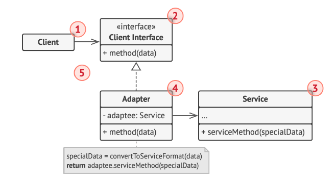
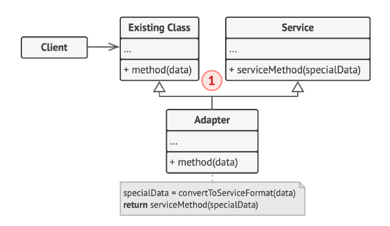

### ADAPTER

** Also known as: Wrapper **

Adapter is a structural design pattern that allows objects with incompatible interfaces to collaborate.

### Object Adapter

This implementation uses the object composition principle: the adapter implements the interface of one object and wraps
the other one. It can be implemented in all popular programming languages.

Source: Refactoring.guru

### Class Adapter

This implementation uses inheritance: the adapter inherits interfaces from both objects at the same time. This approach
can only be implemented in programming languages that support multiple inheritance, such as C++ and Python.

Source: Refactoring.guru

### Class Adapter vs Object Adapter

There are two strong reasons to prefer the Object Adapter over the Class Adapter:
* loose coupling
* multiple inheritance is tricky

With the Object Adapter you have loose coupling, so the Client is not required to know anything about the Supplier.
The Smartphone doesn’t care where it gets its 5 volts. As long as it gets them, it will charge.
With the Class Adapter you lose this property, because you have a new entity which is defined by the Client and
the Supplier, and it works only for this specific type of Client and specific type of Supplier. This means that
you have created an interface which allows you to use the Client and the Supplier, but where Client and Supplier
are strongly coupled. Since you usually want to design interfaces to uncouple things, this is not a desired property.

### References

* https://www.giacomodebidda.com/posts/adapter-pattern-in-python/
* https://github.com/jackdbd/design-patterns